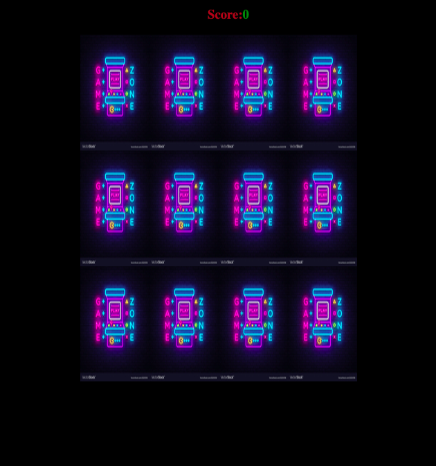

# memory Game 

> this is a game where you match pairs of pictures by memory.

## Built With

- Git
- Github
- GitFlow
- VSCode
- HTML
- CSS
- javascipt

## Live Demo
[Live Demo]()

### Deployment

- Javascipt

## Author

👤 **Amal Hersi**

- GitHub: [Amal Hersi](https://github.com/Amalcxc)

- Twitter: [@Amalcx4](https://twitter.com/home?lang=en)

- LinkedIn: [Amal Hersi](https://www.linkedin.com/in/amal-hersi-a29583205/)

## 🤝 Contributing

- Contributions, issues and feature requests are welcome!

## Show your support

- Give a ⭐️ if you like this project!

## Acknowledgments
- freeCodeCamp
- Thanks to everyone commiting in this project.

## 📝 License

- This project is [MIT](./MIT.md) licensed.

